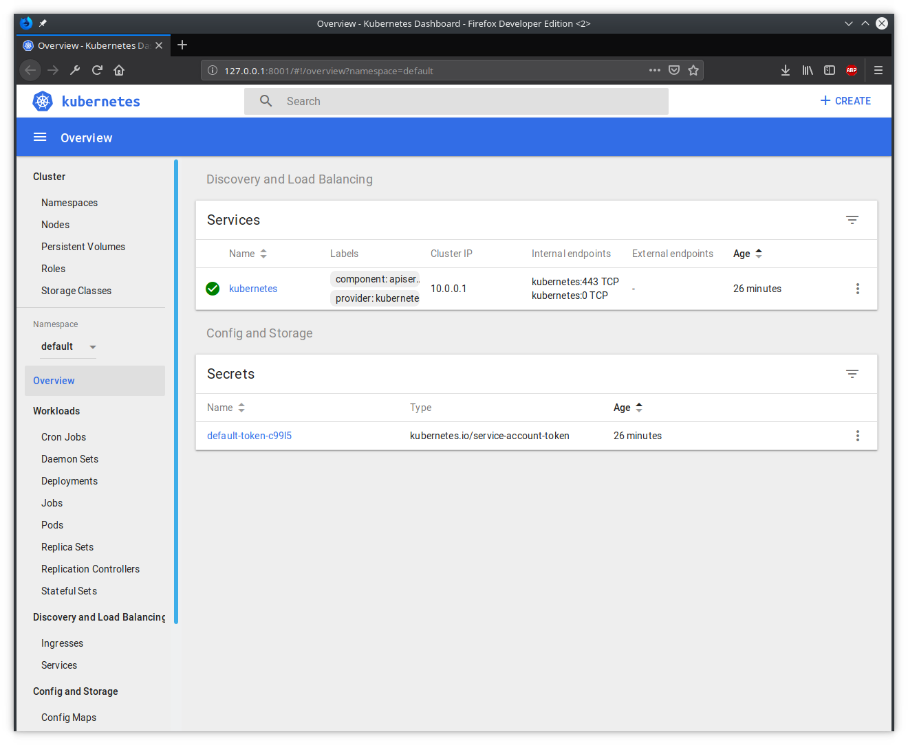

# Setup Kubernetes

## Setup your dashboard

Use the following steps to open the Kubernetes dashboard.

1. Open Azure CLI version 2.0.27 or higher. The version does not work in Cloud Shell and must be running on your local computer. [Instruction for installing Azure CLI](https://docs.microsoft.com/nl-nl/cli/azure/install-azure-cli?view=azure-cli-latest)

2. If you have not yet installed kubectl in CLI, run the following command:

```bash
$ az aks install-cli
Downloading client to "/usr/local/bin/kubectl" from "https://storage.googleapis.com/kubernetes-release/release/v1.12.0/bin/linux/amd64/kubectl"
Please ensure that /usr/local/bin is in your search PATH, so the `kubectl` command can be found.
```
3. Get the references for your cluster with the following command:

```bash
$ az aks get-credentials --resource-group k8slab --name wigo4it-k8s
Merged "wigo4it-k8s" as current context in /home/*******/.kube/config
```

4. Open the Kubernetes dashboard with the following command:

```bash
$ az aks browse --resource-group k8slab --name wigo4it-k8s
az aks browse --resource-group k8slab --name wigo4it-k8s
Merged "wigo4it-k8s" as current context in /tmp/tmpmvcii05n
Proxy running on http://127.0.0.1:8001/
Press CTRL+C to close the tunnel...
Forwarding from 127.0.0.1:8001 -> 9090
Forwarding from [::1]:8001 -> 9090
Handling connection for 8001
```

Your default webbrowser will popup and will show the dashboard for your kubernetes cluster running on Azure

